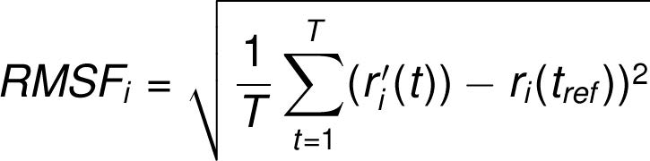

● **The Root Mean Square Deviation (RMSD)** is used to measure the average
change in displacement of a selection of atoms for a particular frame with respect
to a reference frame. It is calculated for all frames in the trajectory. The RMSD for
frame x is:
.jpg)

where N is the number of atoms in the atom selection; tref is the reference time,
(typically the first frame is used as the reference and it is regarded as time t=0);
and r' is the position of the selected atoms in frame x after superimposing on the
reference frame, where frame x is recorded at time tx. The procedure is repeated
for every frame in the simulation trajectory.

● **Protein RMSD**: The plot shows the RMSD evolution of a protein (left Y-axis). All
protein frames are first aligned on the reference frame backbone, and then the
RMSD is calculated based on the atom selection. Monitoring the RMSD of the
protein can give insights into its structural conformation throughout the
simulation. RMSD analysis can indicate if the simulation has equilibrated — its
fluctuations towards the end of the simulation are around some thermal average
structure. Changes of the order of 1-3 Å are perfectly acceptable for small,
globular proteins. Changes much larger than that, however, indicate that the
protein is undergoing a large conformational change during the simulation. It is
also important that your simulation converges — the RMSD values stabilize
around a fixed value. If the RMSD of the protein is still increasing or decreasing
on average at the end of the simulation, then your system has not equilibrated,
and your simulation may not be long enough for rigorous analysis.

● **Ligand RMSD**: Ligand RMSD (right Y-axis) indicates how stable the ligand is
with respect to the protein and its binding pocket. In the above plot, 'Lig fit Prot'
shows the RMSD of a ligand when the protein-ligand complex is first aligned on
the protein backbone of the reference and then the RMSD of the ligand heavy
atoms is measured. If the values observed are significantly larger than the RMSD
of the protein, then it is likely that the ligand has diffused away from its initial
binding site. 'Lig fit Lig' shows the RMSD of a ligand that is aligned and
measured just on its reference conformation. This RMSD value measures the
internal fluctuations of the ligand atoms.

● **The Root Mean Square Fluctuation (RMSF)** is useful for characterizing local changes
along the protein chain.
The RMSF for residue i is:

where T is the trajectory time over which the RMSF is calculated, tref is the reference
time, ri is the position of residue i; r' is the position of atoms in residue i after
superposition on the reference, and the angle brackets indicate that the average of the
square distance is taken over the selection of atoms in the residue. On this plot, peaks
indicate areas of the protein that fluctuate the most during the simulation. Typically you
will observe that the tails (N- and C-terminal) fluctuate more than any other part of the
protein. Secondary structure elements like alpha helices and beta strands are usually
more rigid than the unstructured part of the protein, and thus fluctuate less than the loop
regions.

● **B factors**: The RMSF of the protein can also be correlated with the experimental x-ray
B-factor (right Y-axis).Due to the difference between the RMSF and B-factor definitions,
one-to-one correspondence should not be expected. However, the simulation results
should parallel the crystallographic data

●**The Ligand Root Mean Square Fluctuation (L-RMSF)** is useful for characterizing
changes in the ligand atom positions. The RMSF for atom i is:
where T is the trajectory time over which the RMSF is calculated, tref is the reference
time (usually for the first frame, and is regarded as the zero of time); r is the position of
atom i in the reference at time tref, and r' is the position of atom i at time t after
superposition on the reference frame. Ligand RMSF shows the ligand's fluctuations
broken down by atom, corresponding to the 2D structure in the top panel. The ligand
RMSF may give you insights on how ligand fragments interact with the protein and their
entropic role in the binding event. In the bottom panel, the 'Fit Ligand on Protein' line
shows the ligand fluctuations, with respect to the protein. The protein-ligand complex is
first aligned on the protein backbone and then the ligand RMSF is measured on the
ligand heavy atoms. 'Ligand' line shows fluctuations where the ligand in each frame is
aligned on the ligand in the reference frame, and its fluctuations are measured for the
ligand heavy atoms. These RMSF values reflect the internal atom fluctuations of the
ligand.

Protein interactions with the ligand can be monitored throughout the simulation. These
interactions can be categorized by type and summarized, as shown in the plot above.

*Protein-ligand interactions (or 'contacts') are categorized into four types*: Hydrogen
Bonds, Hydrophobic, Ionic and Water Bridges. Each interaction type contains more
specific subtypes, which can be explored through the 'Simulation Interactions Diagram'
panel. The stacked bar charts are normalized over the course of the trajectory: for
example, a value of 0.7 suggests that 70% of the simulation time the specific interaction
is maintained. Values over 1.0 are possible as some protein residue may make multiple
contacts of same subtype with the ligand.

1. Hydrogen Bonds: (H-bonds) play a significant role in ligand binding. Consideration of
hydrogen-bonding properties in drug design is important because of their strong
influence on drug specificity, metabolization and adsorption. Hydrogen bonds between a
protein and a ligand can be further broken down into four subtypes: backbone acceptor;
backbone donor; side-chain acceptor; side-chain donor. The current geometric criteria
for protein-ligand H-bond is: distance of 2.5 Å between the donor and acceptor atoms
(D—H···A); a donor angle of ³120° between the donor-hydrogen-acceptor atoms
(D—H···A); and an acceptor angle of ³90° between the
hydrogen-acceptor-bonded_atom atoms (H···A—X).

2. Hydrophobic contacts: fall into three subtypes: p-Cation; p-p; and Other, non-specific
interactions. Generally these type of interactions involve a hydrophobic amino acid and
an aromatic or aliphatic group on the ligand, but we have extended this category to also
include p-Cation interactions. The current geometric criteria for hydrophobic interactions
is as follows: p-Cation — Aromatic and charged groups within 4.5 Å; p-p — Two
aromatic groups stacked face-to-face or face-to-edge; Other — A non-specific
hydrophobic sidechain within 3.6 Å of a ligand's aromatic or aliphatic carbons.

3. Ionic interactions: or polar interactions, are between two oppositely charged atoms
that are within 3.7 Å of each other and do not involve a hydrogen bond. We also monitor
Protein-Metal-Ligand interactions, which are defined by a metal ion coordinated within
3.4 Å of protein's and ligand's heavy atoms (except carbon). All ionic interactions are
broken down into two subtypes: those mediated by a protein backbone or side chains.

4. Water Bridges: are hydrogen-bonded protein-ligand interactions mediated by a water
molecule. The hydrogen-bond geometry is slightly relaxed from the standard H-bond
definition. The current geometric criteria for a protein-water or water-ligand H-bond are:
a distance of 2.8 Å between the donor and acceptor atoms (D—H···A); a donor angle of
³110° between the donor-hydrogen-acceptor atoms (D—H···A); and an acceptor angle
of ³90° between the hydrogen-acceptor-bonded_atom atoms (H···A—X).

**UFF energy minimization** - UFF (Universal Force Field) is capable of reproducing the
most structural feature across the periodic table. This force field can optimize the
geometry for all elements, and does well with inorganic materials, and organometallic
materials.

**DDG** - DDG stands for delta delta G or change in change of gibbs free energy, which is
a marker of how much the binding efficiency is increased by a particular change in
terms of exergonic reactions (reactions which possess change in Gibb’s free energy as
a negative value)

**CUPSAT** is a tool to predict changes in protein stability upon point mutations. The
prediction model uses amino acid-atom potentials and torsion angle distribution to
assess the amino acid environment of the mutation site. Additionally, the prediction
model can distinguish the amino acid environment using its solvent accessibility and
secondary structure specificity.

**HotSpot Wizard 3** is a web server for an automated design of mutations and smart
libraries for the engineering of protein function and stability and the annotation of protein
structures. The identification of mutagenesis hot spots is based on the integration of
structural, functional and evolutionary information obtained from several bioinformatics
databases and computational tools.
>Users can explore hot spots identified by four different protein engineering strategies: (i)
functional hot spots represented by highly mutable residues located in the catalytic
pocket and/or access tunnels, (ii) stability hot spots (structural flexibility approach)
represented by flexible residues, (iii) stability hot spots (sequence consensus approach)
represented by positions which are frequently occupied by the same residue in
sequence homologs, and (iv) correlated hot spots represented by pairs of coevolving
residues that modulate enzyme activity and selectivity.

For each of these strategies, HotSpot Wizard lists residues ordered by their predicted
suitability for mutagenesis together with relevant analysis-specific information and filters
enabling users to reduce the set of identified hot spots to only the most promising
candidates or to select hot spots based on their criteria. Detailed annotations of each
position include also amino acid frequencies in sequence homologs and predicted
tolerated amino acids that can be used to select suitable substitutions for individual hot
spots and design appropriate degenerate codons directly through the HotSpot Wizard
interface. Hot spots, as well as any other residues, can be visualized in the structure
together with identified pockets and tunnels to explore their structural context.