# Results 

###Molecular docking of Wild-type laccase enzyme with AFB1, AFG1 and NE

Binding energies obtained from docking of wild-type laccase enzymes yielded very positive results which were essential in establishing the inert potential of the toxin to get bound and degraded by the enzyme, and proved to further progress the previous findings about laccase enzyme to be very effective at degrading Aflatoxin B1 (-7.8 kcal/mol) and similar binding energy of Aflatoxin G1 (-8.3 kcal/mol)  extended those results to indicate that Laccase enzyme from Myceliophthora thermophilus possesses potential to degrade all variants of Aflatoxins produced by varying species rather than just one variant of the toxin. The comparison to binding energy of NE (-4.6 kcal/mol) (Nonaethylene Glycol) helped provide a comparison state of binding energy in the analysis.

`Laccase (WT) with NE`

 

`Laccase (WT) with AFB1`

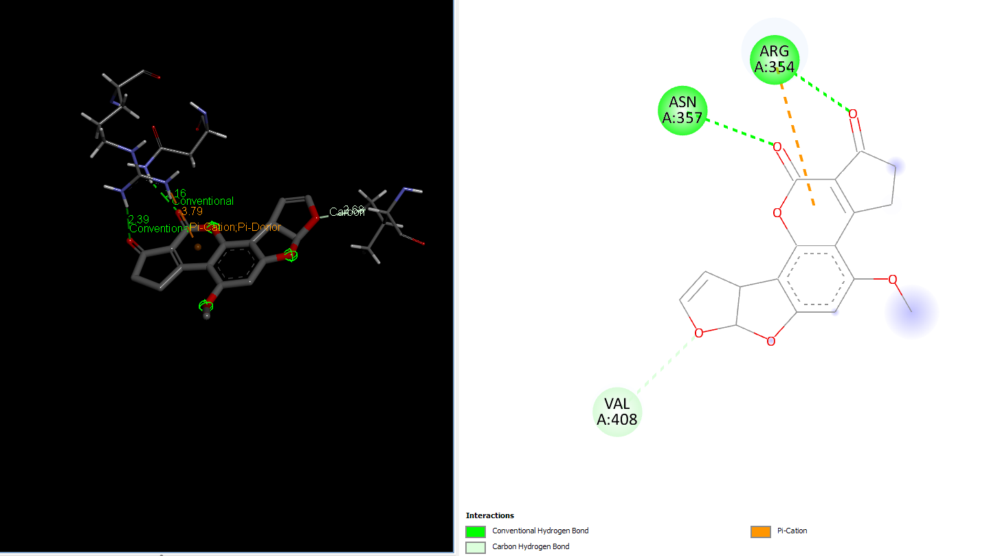

`Laccase (WT) with AFG1`

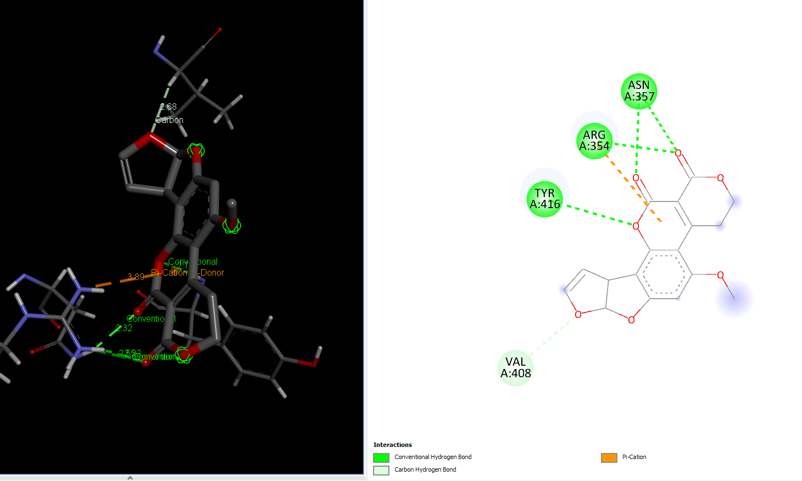

**Creation of mutants from predictions from [HotSpot Wizard](https://loschmidt.chemi.muni.cz/hotspotwizard/) and [CUPSAT](http://cupsat.tu-bs.de/) using PyMOL**

Total 14 residues were generated from HotSpot wizard of whom point mutations were checked to be stabilizing or destabilizing at stability and functional hotspots. Out of those 14 only 8 of the residues had favorable point mutations and the most stabilizing mutations were introduced in the laccase enzyme (point mutations) and molecular docking was reperformed for each mutant to check for impact. From CUPSAT the entire list of impact of point mutation on stability for each residue in the structure of laccase provided to the server was checked and top 10 results based on maximum Delta Delta G (DDG) energy were taken to be introduced to laccase and subsequently molecular docking was performed to see the impact of these point mutations on binding energy of laccase to both variants of Aflatoxin. *None of the residues with histidine changes were taken from either servers for mutation due to critical function of histidine in the enzyme structure for interacting with the essential 4 copper ions in the functional enzyme.*

### HotSpot Wizard Server Predictions 

### CUPSAT Server Predictions
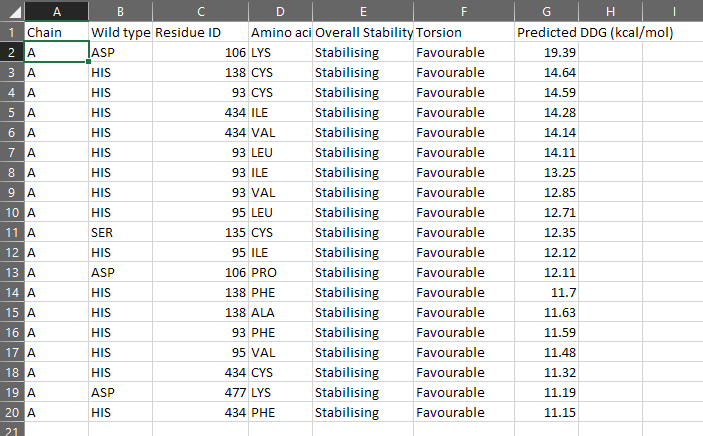

*DDG (Delta Delta Gibbs Free Energy)values indicate the increase in stability after making the point mutation.* 
***

**Data Analysis and sorting to reveal most beneficial mutants based on molecular docking results**

All binding energy results obtained from docking the 20 point mutation mutants of laccase we tested were placed in a common excel file and sorted to reveal the mutants with highest binding energy for each of the toxins. Top 4 results were filtered out and when compared with docking results of the Wild-type laccase enzyme to reveal that mutation at 480 Met position to Val yielded significant bump in binding energy of AFG1, mutation at 182 Glu position to Tyr yielded significant bump in binding energy of AFG1, mutation at 181 Asp position to Trp yielded significant bump in binding energy of AFB1, and mutation at 106 Asp position to Lys yielded significant bump in binding energy of AFG1. Maximum bumps in binding energy were observed in 106_asp-lys mutation for AFG1 and 181_asp-trp mutation for AFB1.

### All Mutations We Tested ###

***
> 14421 --> AFG1 & 186907 --> AFB1
### Best mutations 
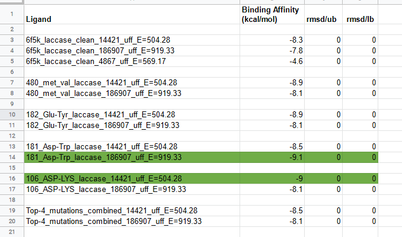
> The top 4 results yielding mutations were mutated at the same time in laccase to test the effect cumulative effect of top 4 stabilizing and activity enhancing point mutations, but did not yield good results as the increase in binding energy observed after performing molecular docking of the Top-4_mutations_combined laccase with AFG1 and AFB1, hence multiple mutations were not further considered in this study.

***
`AFG1 Interaction with 106_asp-lys mutant laccase`

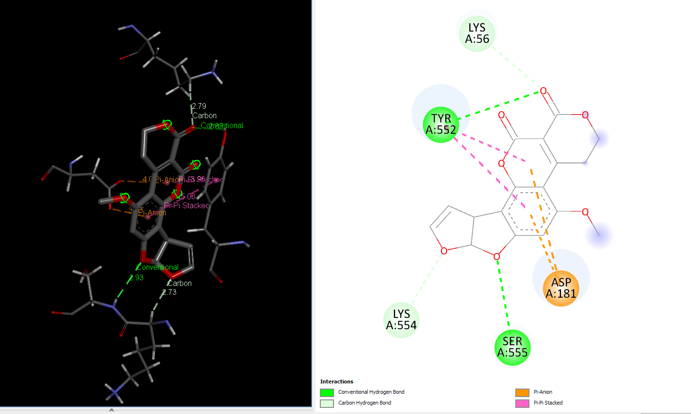

`AFB1 interaction with 181_asp-trp mutant laccase`

***

##Molecular Dynamics of control and highest binding energy mutants of laccase

Two of the best mutants i.e. 106_asp-lys for its increased binding energy of AFG1 and 181_asp-trp for its increased binding energy of AFB1 were selected along with control i.e. Wild-type laccase complexes with AFG1 and AFb1 respectively were put through further analysis and validation of binding energy and complex stabilities in a water based system by the means of Molecular dynamics using Schrodinger Desmond and the analysis was run for 50ns. 

**Interpretation of AFG1 interaction with Wild-type laccase and 106_asp-lys mutant** 

*Protein-Ligand RMSD* – Change in RMSD of the Wild-type laccase throughout the 50ns simulation was ~ 1 angstrom whereas change in RMSD of the mutant laccase was ~1.2 angstrom indicating better stability of Wild-type laccase. Maximum RMSD change with value ~ 1.5 angstrom was observed between 0-10ns in the Wild-type laccase whereas Maximum RMSD change with value ~ 1.4 angstrom between 30-40ns of the simulation, indicating slight enhancement in stability of the interaction.

`Laccase (WT) - AFG1 complex RMSD`

`106_asp-lys mutant - AFG1 complex RMSD`

*Protein RMSF* – Peaks represent the residues with the highest fluctuations measured in angstroms during the 50ns simulation. Displacement of C-alpha from B-Factor was observed to be greater in the mutant laccase as compared to displacement of C-alpha from B-Factor in Wild-type laccase.

`Laccase (WT) - AFG1 complex RMSF`

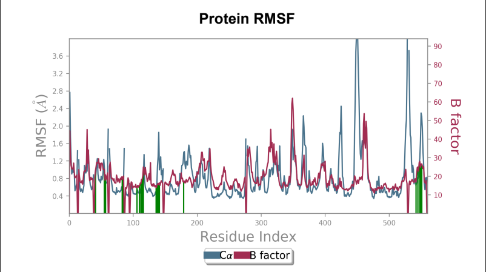

`106_asp-lys mutant - AFG1 complex RMSF`

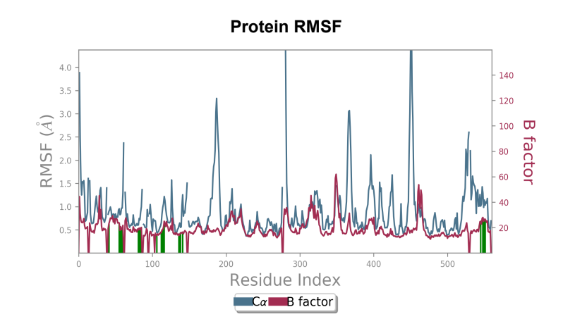

*Ligand RMSF* – Ligand RMSF saw a change in maximum RMSF value ~ 1 angstrom when mutant laccase was compared to wild-type laccase (reduction in maximum RMSF value was present in mutant) and overall stabilization of fluctuations were present in the ligand bound to mutant laccase when compared to wild-type laccase.

`Laccase (WT) - AFG1 complex; Ligand RMSF`

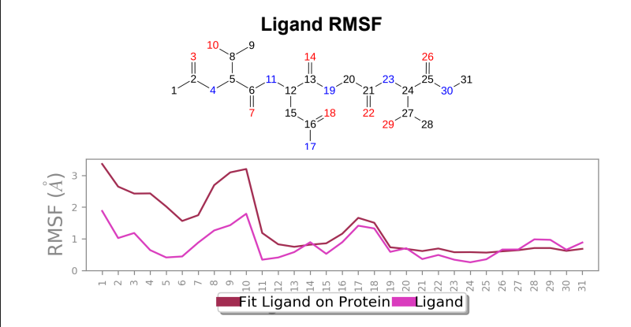

`106_asp-lys mutant - AFG1 complex; Ligand RMSF`

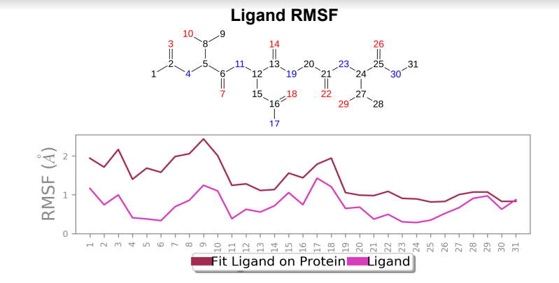

*Protein-Ligand Plots and Diagram* – It was observed that the wild-type laccase-ligand complex possessed 6 protein-ligand contact residues at which contact was maintained throughout the 50ns simulation of which 3 residues (LEU85, ILE116 & GLN144) possessed more than one type of interactions with the ligand, indicating the residues at which strongest interaction is observed. In the mutant laccase-ligand complex, interactions at 4 residues persisted throughout the entire 50ns simulation, of which 3 residues (GLU42, ILE116 & TYR546) showed more than a single type of interaction. GLU42 residue in the mutant laccase-complex possessed the highest interaction fraction of the two complexes analyzed with value greater than 2. This indicates very strong interaction at GLU42 residue in the mutant-laccase complex. Intensity of orange color indicates number of contacts of a particular residue with the ligand.

`Laccase (WT) Protein-Ligand Contact plots and diagram`

`106_asp-lys mutant laccase Protein-Ligand Contact plots and diagram`

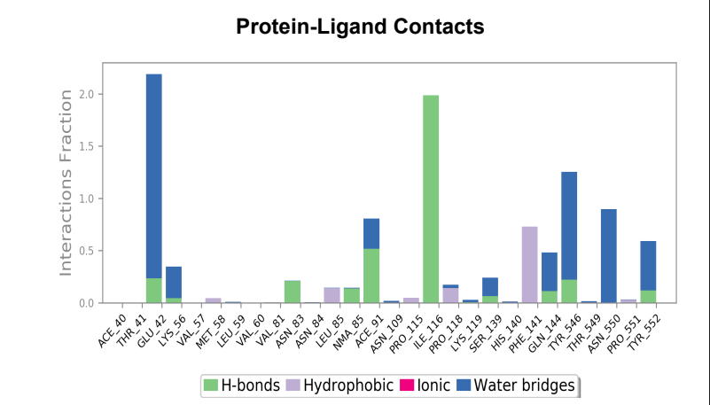

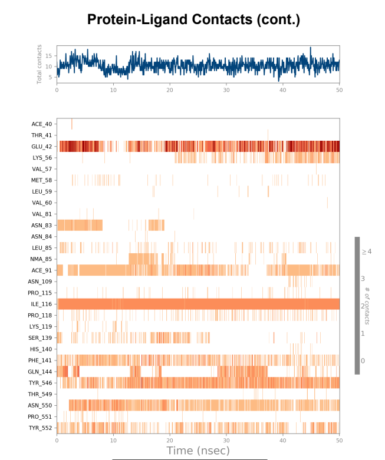

***

**Interpretation of AFB1 interactions with Wild-type laccase and 181_asp-trp mutant**

*Protein-ligand RMSD* - Change in RMSD value of Wild-type laccase throughout the 50ns simulation was nearly ~ 1.6 angstrom, whereas the mutant laccase RMSD change throughout the 50ns simulation was 1 angstrom indicating enhancement in stability of protein structure by point mutation introduced. General fluctuations saw a downward trend in the mutated laccase-AFB1 complex indicating enhanced ability of the ligand to stay in the binding pocket. Net change in ligand RMSD saw a reduction of ~ 0.3 angstrom, indicating enhanced ability to stay bound in the binding pocket of the ligand.     

`Laccase (WT) - AFB1 complex RMSD`

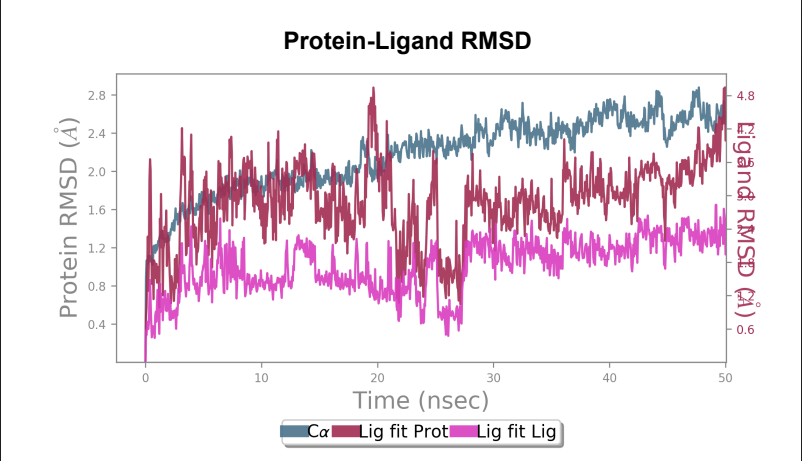

`181_asp-trp mutant laccase - AFB1 complex RMSD`

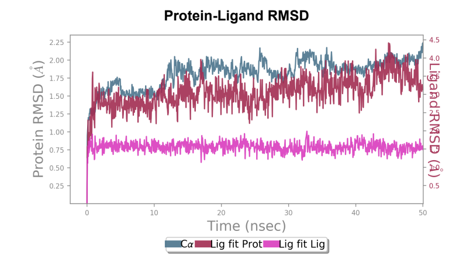

*Protein RMSF* - Peaks represent the residues with the highest fluctuations measured in angstroms during the 50ns simulation. Displacement from C-alpha of the B factor is observed to be less in the mutant laccase when compared to the Wild-type laccase complex. Maximum fluctuation also saw a dip from 4.5 angstrom to 3.6 angstrom when comparing Wild-type laccase to mutant laccase, indicating enhanced stability of the protein structure. 

`Laccase (WT) - AFB1 complex RMSF`

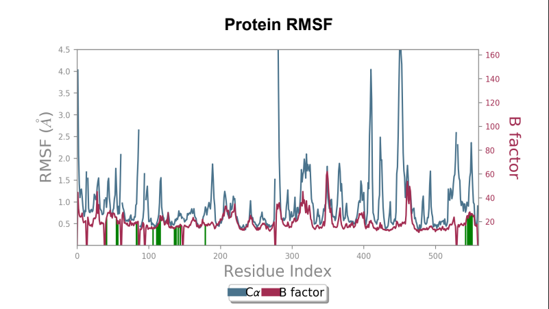

`181_asp-trp mutant laccase - AFB1 complex RMSF`

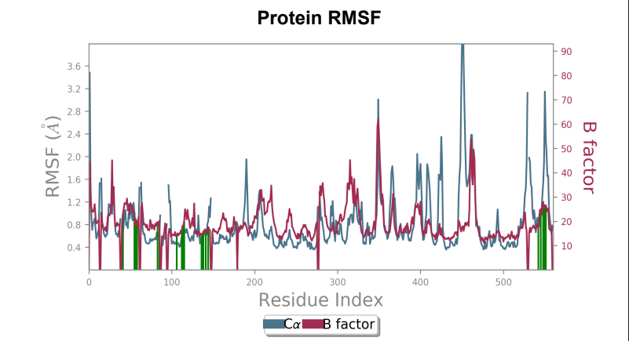

*Ligand RMSF* - Maximum ligand RMSF values saw a reduction of 1 angstrom in the mutant laccase variant, and total fluctuations across the ligand at all atomic positions experienced a reduction in RMSF values.

`Laccase (WT) - AFB1 complex; Ligand RMSF`

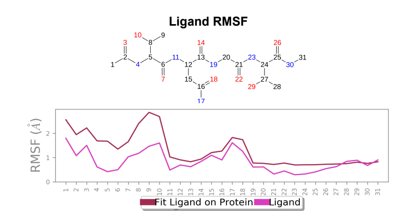

`181_asp-trp mutant laccase - AFB1 complex; Ligand RMSF`

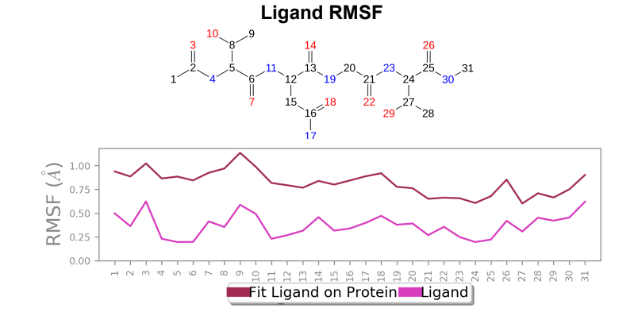

*Protein-Ligand contact plots and diagrams* - It was observed that in the wild-type laccase ligand complex, there are 6 residues which remained in contact with the ligand throughout the 50ns simulation of which 3 residues (GLU42, ILE116 & GLN144) interacting with the ligand in multiple subtypes of interaction. Whereas in the mutant-laccase ligand complex, there are 5 residues which remained in contact with ligand throughout the 50ns simulation, interestingly the same 3 residues (GLU42, ILE116 & GLN144) are the ones interacting with the ligand in more than one type of interaction and hence strengthening the interaction of ligand with the protein. GLU42 residue presents a very strong interaction with ligand, and could be the reason for better binding energy observed in the mutant laccase. Intensity of orange colour indicates number of contacts of a particular residue with the ligand.

`Laccase (WT) Protein-Ligand Contact plots and diagram`

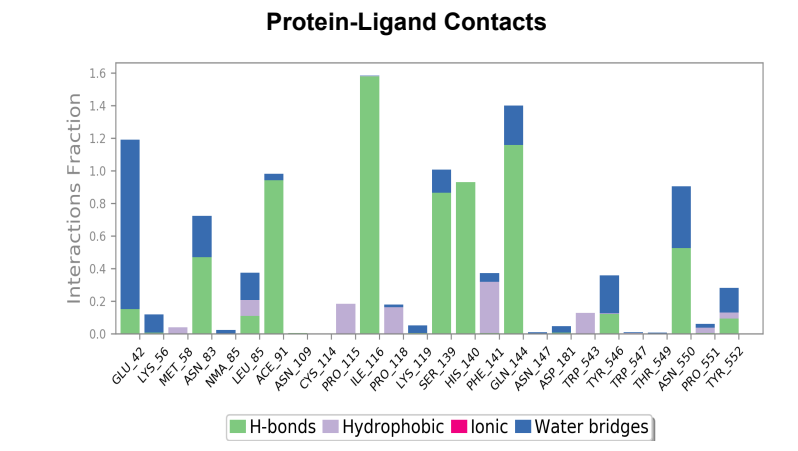

`181_asp-trp mutant laccase Protein-Ligand Contact plots and diagram`

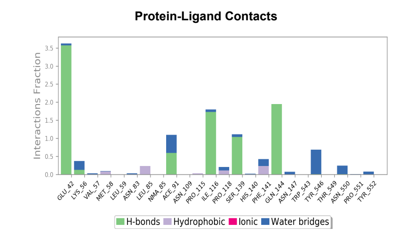

