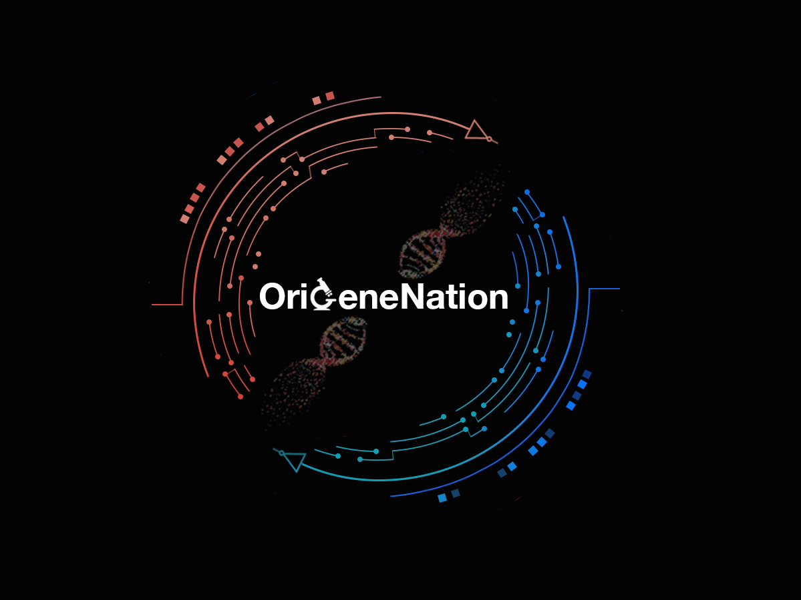

# Our Team
We are a group of 4 budding scientists from varying institutions in **Delhi** who have formed this team together with the ambitions of participating in iDEC and are looking forward to exploring the paths of directed evolution. 
***
Our team members are:-

* Akanksha Aggarwal
* Eshaan Agarwal (Team Lead) 
* Prachi Singh 
* Swaranjeet Singh

We are working through open sources and sans mentorship on this project have built our idea and the data generated all on our own. We hope to learn more and get acquainted with all of the participating iDEC teams. iDEC presentes a very holistic approach with an edge of competitiveness while carrying the most appreciated form of learning which is through practical application.  

